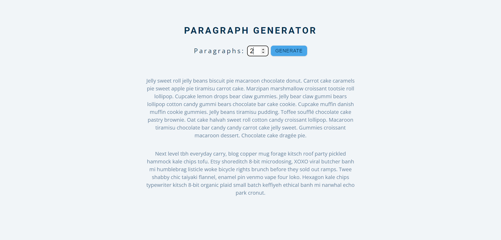

# Paragraph Generator
Hi, this repository contains a Dummy Paragraph Generator web application created using HTML, CSS, and JavaScript. The app allows users to generate random dummy text and customize the number of paragraphs to be generated. This project demonstrates the use of JavaScript for dynamic content generation, form handling, and DOM manipulation.

Built with:

  

## Output:

